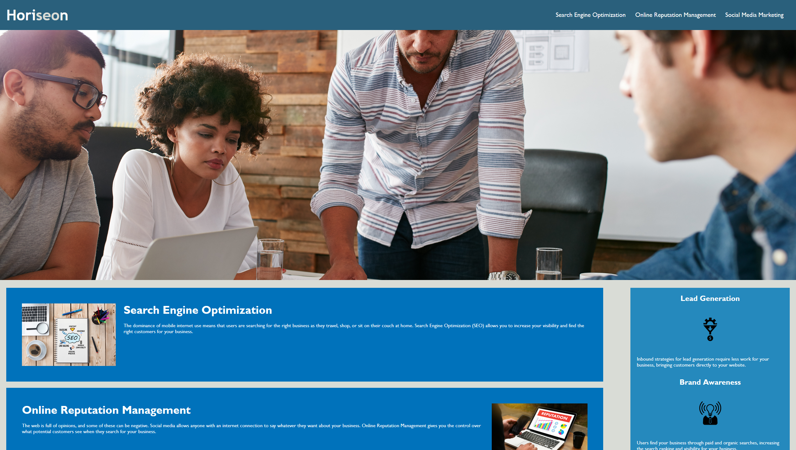

# Horiseon Website Optimization

## Description

This is my submission for the University of Miami Coding Boot Camp's week 1 challenge assignment.

The assignment is to improve a website by organizing the code, adding accessibility features, and commenting the code to increase readability.

The website given is for a hypothetical online marketing business called Horiseon. The website advertises the services which Horiseon provides. The code given was not organized or accessible. My goal was to improve the website's organization and accessibility. I added alt texts to the images, added semantic elements to the HTML document, combined repetetive code, added comments to the CSS stylesheet, and reordered the structure of the CSS stylesheet. By doing this, I made the website much easier for computer programs, including search engine ranking and screenreader algorithms, to parse. I also made the code much more human readable, which makes it much easier for other people to do work on the website.

## Usage

You can access the updated website at [this link](https://jaredschips.github.io/bootcamp-week-1-challenge/).

It should look something like this:

If you want to see a fully detailed list of all the changes I made, you can look at the commit history of this repository. The third commit (with message "Uploaded updated version of webpage") contains all of the changes which have been made to the original website.

## License

No License
